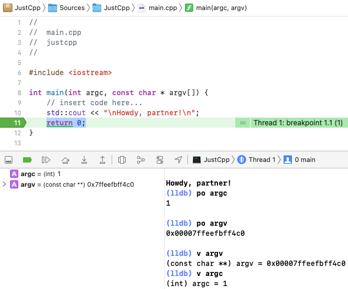

# JustCpp

`JustCpp` is a minimal "Hello, World!" example for building and running a pure C++ executable with the Swift Package Manager on macOS. An example test is also included.

_main.cpp_

``` cpp
#include <iostream>

int main(int argc, const char * argv[]) {
    std::cout << "\nHowdy, partner!\n";
    return 0;
}
```

``` swift
// swift-tools-version:5.4
import PackageDescription

let package = Package(
    name: "JustCpp",
    dependencies: [ ],
    targets: [
        .executableTarget(
            name: "JustCpp",
            dependencies: []),
        .testTarget(
            name: "JustCppTests",
            dependencies: ["JustCpp"]),
    ],
    cxxLanguageStandard: CXXLanguageStandard.cxx14
)
```

**Command Line**

Run the following commands to build from the terminal shell.

``` sh
cd PATH_TO/JustCpp

swift build
# [2/2] Linking JustCpp
# 
# * Build Completed!

swift run

# [1/1] Planning build
# 
# * Build Completed!
# Howdy, partner!

swift test

# [3/3] Linking JustCppPackageTests
# 
# * Build Completed!
# Test Suite 'All tests' started at 2021-05-27 18:42:18.380
# Test Suite 'JustCppPackageTests.xctest' started at 2021-05-27 18:42:18.381
# Test Suite 'JustCppTests' started at 2021-05-27 18:42:18.381
# Test Case '-[JustCppTests.JustCppTests testExample]' started.
# Test Case '-[JustCppTests.JustCppTests testExample]' passed (0.068 seconds).
# Test Suite 'JustCppTests' passed at 2021-05-27 18:42:18.449.
# 	 Executed 1 test, with 0 failures (0 unexpected) in 0.068 (0.068) seconds
# Test Suite 'JustCppPackageTests.xctest' passed at 2021-05-27 18:42:18.449.
# 	 Executed 1 test, with 0 failures (0 unexpected) in 0.068 (0.068) seconds
# Test Suite 'All tests' passed at 2021-05-27 18:42:18.449.
# 	 Executed 1 test, with 0 failures (0 unexpected) in 0.068 (0.070) seconds

## Delete build artifacts
swift package clean

## Reset the complete cache/build directory
swift package reset
```

**Xcode**

Open `Package.swift` in Xcode. The file can be opened by right-clicking on `Package.swift` and selecting "Open With > Xcode". The file can also be opened using the "Xcode > File > Open..." menu item.

The Xcode "Product > Build", "Product > Run", "Product > Test", and "Product > Clean Build Folder" work with package.

A breakpoint can be set on the `return 0;` line to see the debug console.

 